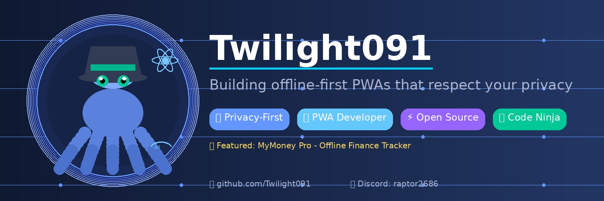

  

# 👋 Hi, I'm Twilight091

> Building apps that work offline, work everywhere, and respect your privacy.

---

## 🚀 About Me

- 💻 **Full-Stack Developer** passionate about PWAs and offline-first applications
- 🔒 **Privacy Advocate** - I build apps where your data stays on your device
- 🌐 **Open Source Contributor** - Believer in free, accessible software for everyone
- 📱 **Mobile-First** - If it doesn't work on mobile, it doesn't work

---

## 🛠️ Tech Stack

### Frontend

### Backend & Database

### Tools & Platforms

---

## 📱 Featured Project

### 💰 [MyMoney Pro](https://github.com/Twilight091/MyMoney)

A secure, offline-first personal finance tracker built as a Progressive Web App.

**✨ Features:**
- 🔒 **100% Offline** - Works without internet
- 📊 **Visual Reports** - Interactive charts for income/expense analysis
- 💸 **Transaction Tracking** - Log income and expenses with categories
- 🤝 **Loan Management** - Track money lent and borrowed
- 🎯 **Budget Planning** - Set monthly budgets with visual progress
- 🌓 **Dark/Light Mode** - Toggle between themes
- 💱 **Multi-Currency** - USD, EUR, GBP, JPY, INR , BDT support

**🛠️ Tech:** HTML5, CSS3, JavaScript, IndexedDB, Chart.js, Service Workers

**🌐 Live Demo:** [twilight091.github.io/MyMoney](https://twilight091.github.io/MyMoney/)

---

## 📊 GitHub Stats

---

## 🎯 Current Focus

- 🔨 Building **offline-first PWAs** that respect user privacy
- 📚 Learning **advanced Service Workers** and **Background Sync**
- 🌟 Contributing to **open source** projects
- 📱 Exploring **WebAssembly** for high-performance web apps

---

## 📫 Connect With Me

💬 **Discord:** `raptor2686`
💌**mail:** uncagedraptor80@gmail.com

---

## 💡 Philosophy

> *"Code should be simple, apps should be fast, and data should be private."*

I believe in building software that:
- ✅ **Respects users** - No tracking, no ads, no data collection
- ✅ **Works everywhere** - Offline-first, progressive enhancement
- ✅ **Stays simple** - Minimal dependencies, maximum performance
- ✅ **Empowers people** - Free, open source, accessible to all

---

## 🏆 Achievements

- 🌟 Created **MyMoney Pro** - Featured PWA with 100% offline functionality
- 📱 Built responsive, mobile-first interfaces
- 🔒 Implemented client-side encryption and local data storage
- 🚀 Deployed production apps on GitHub Pages

---

*Built with ❤️ and ☕ by Twilight091*
